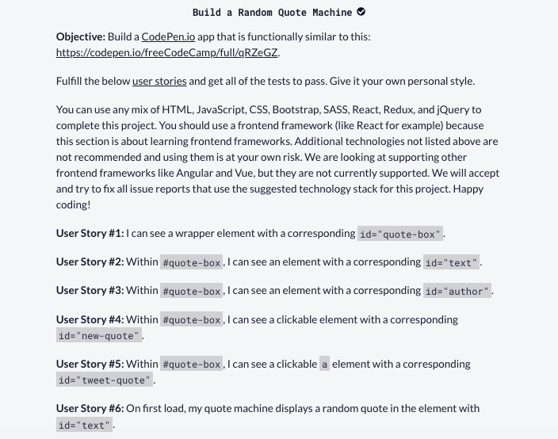
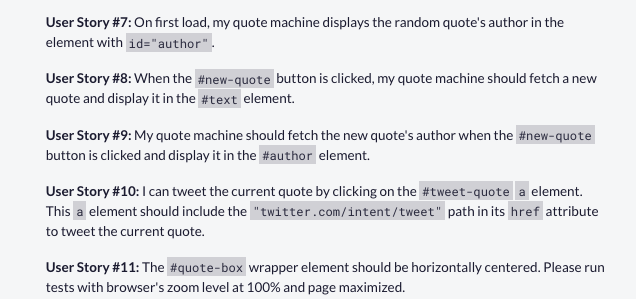
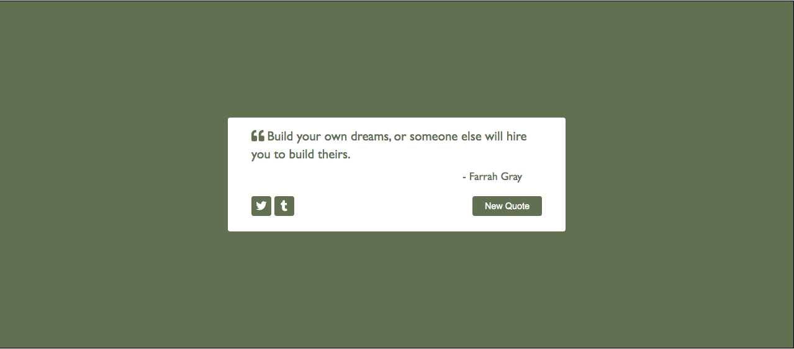

# Random Quote Machine (a.k.a Random Quote Generator)

#### This file covers the following topics 
- App description
- Implementation note
- Note on icons usage
- App Requirements
- App Mock Up

&nbsp;
&nbsp;
### App Description
> This app displays a new quote and it's author and also changes the color of several elements when the 'New Quote' button is clicked. The Tbuttons with the Twitter and Tumblr icons open up respective pages upon clicking.

&nbsp;
&nbsp;
### Implementation Note
App has been implemented using 2 approaches.
- Implementation 1: Upon clicking of the 'New Quote' button, colors are generated using an object that stores color codes
- Implementation 2: Upon clicking of the 'New Quote' button, colors are generated dynamically using a hex code generation function
Both implementations use objects to store the quotes and their respective authors.

&nbsp;
&nbsp;
### Note about icons used in the HTML file
> I've used Fontawesome icons for the up/down arrows in the buttons. These icons are placed within 'i' tags in the HTML file. In order to use Fontawesome icons, one has to download a kit from Fontawesome.com. A kit is basically a script tag supplied by Fontawesome.com which one needs to include in the head section of the HTML. Since my kit is my own, I have **NOT** included it in head section of the HTML file that I have uploaded to this repo. So, if you'd like to use up/down arrow icons that I **do** include in the HTML, please make sure that you **get your own Fontawesome kit and include it in the head section of the HTML.** Alternatively, *you may use icons from any other source online and in that case please make sure you update the HTML file as needed to use your own icons.*

&nbsp;
&nbsp;
### App Requirements

&nbsp;
&nbsp;
### App Mock Up

